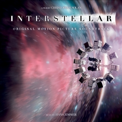

<!-- How to embed audio (see this : https://www.makeuseof.com/tag/embed-mp3-player-website/) 
    
    How to embed audio from onedrive (see this : https://stackoverflow.com/questions/64590120/how-can-i-directly-embed-audio-that-i-have-uploaded-to-onedrive-into-html-using)
 -->

<audio controls><source src="https://onedrive.live.com/download?cid=D34890CD5DE3F34B%216412&authkey=!ALpAbALgko2XJ0A"width="98" height="120" frameborder="0" scrolling="no"></iframe>" type="audio/mpeg">Your browser does not support the audio tag.</audio>

The main theme (especially at the end of the movie) gets so over-theatrical its almost comical. There is this unauthentic, edgy and self-pitiying feel to it. It basically feels like dropping your jam-sandwich on the floor and needing to go to therapy for it. Its one of those scores that try wayyy to hard to sound emotional and moving.

I can't get my head around why people love it so much. Just repeating random organ runs and as you say, an endless loop of simple chords.

Apart from the fact that the score is based on the same uncreative and boring four-note-structure (in what feels like an endless loop - classic Zimmer), i find it hilarious how the instrumentation changes abruptly from a simple "snyth+violin+cello"-setup to this hysterical organ arpeggio overkill.

Not that it would drastically improve the movement of the score, but why not add a choir to give the soundtrack a little bit more of an "ethereal" feeling? Since, you know, this movie is supposed to convey a literal out-of-this-world experience. Or why not use some unusual, alien time-signature? I dont see how this score needed Zimmer to display more than an ounce of musical skill and creativity. Fine, he is good at intonations. He pays attention not only on what is played but also on how it is being played. I give you that.

But from a purely artistic point of view, the Interstellar theme is truly a score for over-sentimental people with the emotional bandwith of a 5 year old (which would probably explain its popularity).

