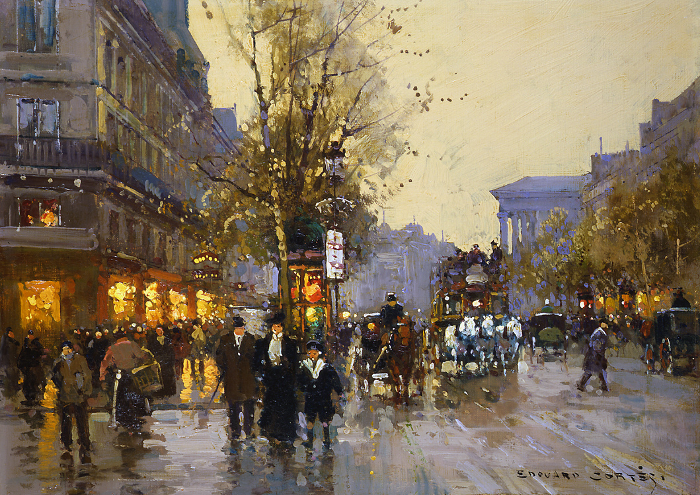

*Boulevard des Capucines" Edouard Léon Cortès (1882 - 1969)*

The painting showcasing Paris cityscapes, combined with Erik Satie's Gymnopédie No. 1, creates an immersive experience that eloquently expresses its own message. I can't help but imagine listening to this piece while walking on a road of Paris in the rain ~~. 5 stars....