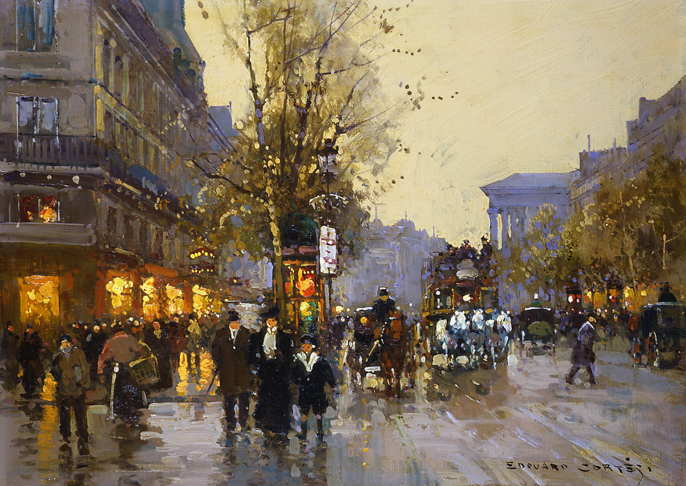

*Boulevard des Capucines" Edouard Léon Cortès (1882 - 1969)*

 <audio controls><source src="https://vmirror.imslp.org/files/imglnks/usimg/0/05/IMSLP849066-PMLP4215-luis-kolodin-plays-satie-s-gymnop%C3%A9die-no.1.mp3" type="audio/mpeg">Your browser does not support the audio tag.</audio>

The painting showcasing Paris cityscapes, combined with Erik Satie's Gymnopédie No. 1, creates an immersive experience that eloquently expresses its own message. I can't help but imagine listening to this piece while walking on a road of Paris in the rain ~~. 5 stars....