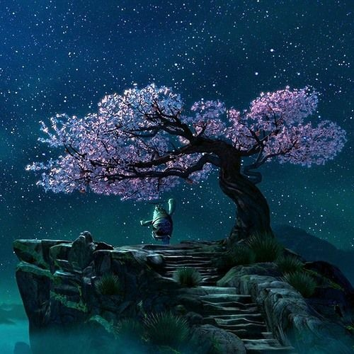

<!-- How to embed audio (see this : https://www.makeuseof.com/tag/embed-mp3-player-website/) 
    
    How to embed audio from onedrive (see this : https://stackoverflow.com/questions/64590120/how-can-i-directly-embed-audio-that-i-have-uploaded-to-onedrive-into-html-using)
 -->

 <audio controls><source src="https://onedrive.live.com/download?cid=D34890CD5DE3F34B&resid=D34890CD5DE3F34B%215928&authkey=AA5EloNytA-BGKw" type="audio/mpeg">Your browser does not support the audio tag.</audio>

Traditional China kinda vibe ~~ Love it. Not being biased but Kung Fu Panda happens to be one of the best animation masterpiece I've ever seen as well. From the storyline to the visual aspect, everything is just spot on.

The erhu solo is a great fit, but it would be even better to incorporate the zither as an additional instrument. The effort of making it sound like mysterical and evoke a sense of traditional Chinese theme is evident but it hasn't quite achived the desired effect. Nevertheless, I appreciate the way the score evolves, similar to the developement of the character from zero to hero, there are ups and downs in the middle and finish with the resounding and majestic finale.

Overall, It is good, entertaining, immersive score, but I think it would fail to leave you any kind of deep down impression. 3.5 stars ?