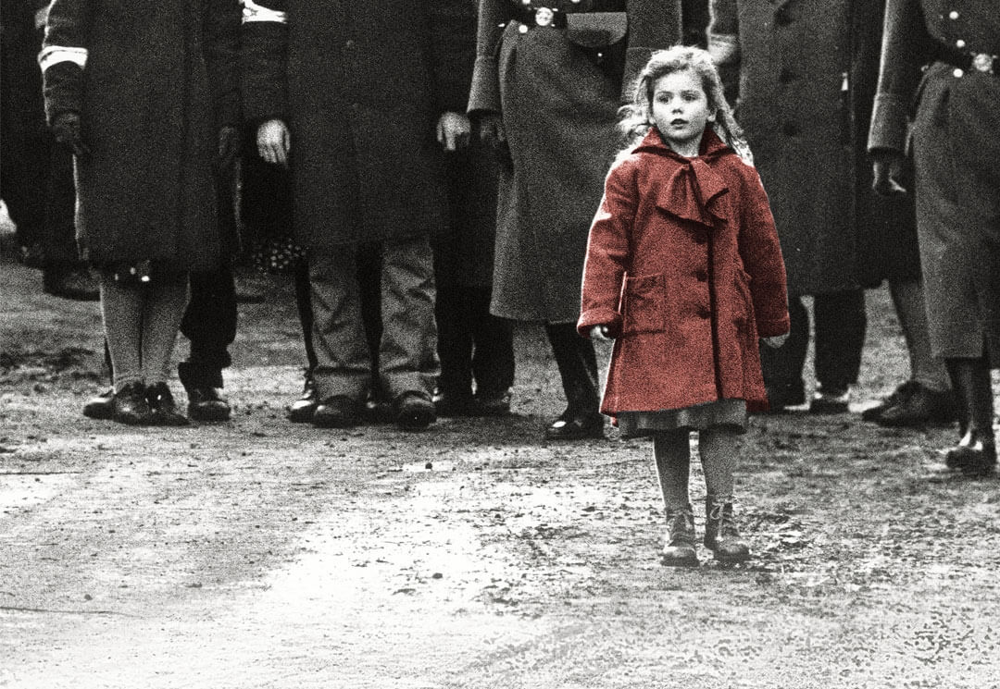

<!-- How to embed audio (see this : https://www.makeuseof.com/tag/embed-mp3-player-website/) 
    
    How to embed audio from onedrive (see this : https://stackoverflow.com/questions/64590120/how-can-i-directly-embed-audio-that-i-have-uploaded-to-onedrive-into-html-using)
 -->

*The film is almost entirely in black and white, with the famous exception of the little girl in the red dress, who is met alive at the beginning of the film, only to recognise her body in a pile of corpses later on.*

<audio controls><source src="https://onedrive.live.com/download?cid=D34890CD5DE3F34B&resid=D34890CD5DE3F34B%215929&authkey=AA2A5cMw24GsKfE" type="audio/mpeg">Your browser does not support the audio tag.</audio>

I get the goosebumps whenever I listen to this instrumental masterpiece. Trust me, sometimes – it’s just too much to handle. I break down many a times when I listen to this piece. It was composed and conducted by [John Williams](https://en.wikipedia.org/wiki/John_Williams), one of the greatest masters of film music, and [Itzhak Perlman](https://en.wikipedia.org/wiki/Itzhak_Perlman) gave the violin cover. No suprise the album won the Academy Award for Best Original Score and a tons of other awards.

The song has a quite sober opening, but starts to rip open your heart from **00:16**. when it starts that loop which made it so famous. It brings tears to myself the first time I heard it. The tone changes completely  from **02:02**; Going off the looping, but never off the track. The interlude blends in with the loop at **02:38**, and it does it ever so beautifully. All throughout the song, you feel as if the loop is trying to convey the sorrow of 6 million unfortunate Jewish souls to you. The song fades off from your ears, but never from your heart. It was utterly beautiful and heartbreaking at the same time. 

It’s the best instrumental movie track ever! It just doesn’t deserve anything less than a 10! 
